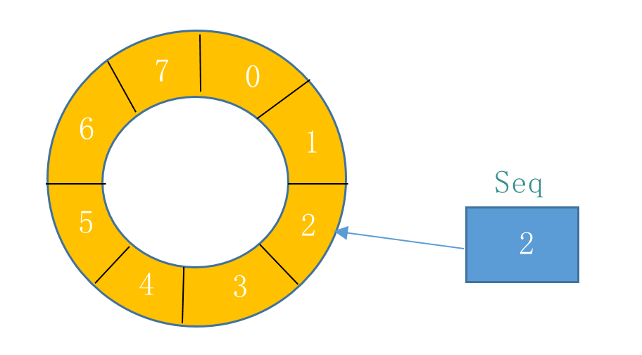

### kvm上跑docker的优缺点

两个通道

kvm的运维，比如拉日志等等（docker 文件映射）

docker容器优开发人员运维。

### 快排的原理

分解成子问题

局部有序

再合并。

Dual-Pivot QuickSort 是考虑了cpu和内存的发展失衡，已经造成memory-wall，所以比较元素扫描个数。

### BeanFactory和ApplicationContext

ApplicationContext主要是解析xml文件，创建bean的定义

BeanFactory，依据定义创建实例，并装配好bean之间的关系。

### Shell中如何自动回填密码

1.重定向

2.管道

echo 'abc' | sudo scp root@111:/home/ddd .

3.expect

spawn scp root@111:/home/ddd .
expect "password"
send 'abc'
interact

### 秒杀

1.物理部署，与详情分开的

2.展示页面CDN化

3.动静分离，静态的图片，js，css，html全部push到CDN上，答题部分回源到题库服务

4.缓存
库存实现缓存扣减

4.流量控制：

Nginx模块
TMD层面的流控：
秒杀流量触发了TMD流控是，返回一个204的响应，即服务端成功应答，但是页面无变化。

RPC服务
HSF的流控：
是针对某一服务的流控，尽管tmd未触发流控，但是可能服务不均匀，在服务也做了一层保护。返回204.

5.防机器秒杀
秒杀开始一定时间内的访问无效。

TMD架构：c/s 结构， client部署在tengine中，进行path的统计，server配置相应path的访问阈值

base_qps,超过该值，按地域请求等权重丢弃请求。

数据库的限流
thread_running，排队， 超过上限，drop

dispatch_command中，

用户权限为super/开启事务/commit.rollback除外

### netty的backlog

设置连接数的上线

含义是队列长度

netty 半连接攻击：1.syn_timeout时间缩短，2.syn_cookie设置，为每个请求分配一个cookie，为SYN包生成一个cookie，不创建连接3.防火墙

### netty ,thrift, avro
thrift/avro 属于rpc框架，支持序列化，与kryo，protobuf，hession属于一个范畴。

netty 更加底层一些。

### 视频

播放器

编码格式，meta，关键帧

播放容器

边下载边播放：流式播放

Nginx有一个支持拖拽的格式

视频分片存储

热点CDN存储，BLOB Storage存储

防盗

### redis的并发

单线程，避免了上下文切换，非阻塞IO

线程封闭，一个任务封闭在一个线程内

如果是复合操作的话，需要外部加锁。

### skiplist的时间复杂度
跳表

ConcurrentSkipListMap

ConcurrentSkipListSet
都是有序的

相对于平衡二叉树(TreeMap)

skipList效率更高，没有旋转问题

redis和level DB(KV数据库)都用到了跳表。

空间换时间的算法结构。

### 内存伪共享
写满缓存行

缓存的协议
MESI协议(Modify,Exclusive,Share,Invalid)

cpu的处理是按照缓存行进行加载处理的，64个字节

缓存行资源的竞争。多个core竞争写缓存行时，轮番抢占，各自cache的都是脏数据，都要通过从主存来获取，更新
触发了伪共享问题。

Disruptor高性能异步架构

1.环形数组

定长

通过sequence与队列长度求& 计算index

因此sequence这个是并发写的一个值。

采用CAS进行无锁进行修改。

但是如果解决内存计算速度和cpu速度不匹配的问题(即伪内存共享问题)

Disruptor采用 给sequence的填充的方式。左右填充。填满整个缓存行。

每个消费者维护一个Seq

采用barrier实现Disruptor多线程之间的依赖关系。

### CAS

自旋锁，适用于持有锁非常短的程序。有尝试次数限制。

compareAndSwap

ABA问题，增加版本号 AtomicStamp

原子操作:CPU执行指令期间，CPU芯片有一条引线LOCK PIN，把电位拉低，把总线锁住，别的核暂时无法访问。

### CMS垃圾回收采用的什么收集算法
标记清除

并发清除时，jvm会停顿下

CMS关注低延迟，

### reactor模型
事件驱动模式，增加了一层调度者

epoll出了数据流，触发工作线程。

主从模型。

### mysql 乐观锁

mysql 乐观锁

1.compareAndSwap:比较number-count>0

2.增加版本字段，比较当前的版本字段是否等于当前的记录，相等则修改，并升版本。低则取消

hbase，支持多条记录。mvvc，写之前先获取版本号。

### 分布式一致性协议
一致性、有序性、容错性。

gossip：cassandra，比较，没有主的概念，两两比较，pull/push

Raft：
一段时间没有心跳，则重新选主，选主，选择事务号最大的fellow作为主。

paxos:

zab：
过半活跃
消息有事务号，有序消费。

消息广播、leader 选举和恢复

恢复，log+snapshot(快照)

### awk命令，文件字符替换命令
awk的命令分割符 是{}
-F指定分隔符

内容替换
perl

perl -pi -e 's/orignal/replace/g' filename

find / -name 'pom.xml' | xargs perl -pi -e 's/orignal/replace/g'

sed

sed -i 's/origin/replace/g' filename

### spring其他组件

### spring装配bean时，初始化顺序问题

接口实现多态

但是ID标识是唯一的

### spring cloud指定进程号

### 红包场景，领红包

红包的生命周期

领取:

把金额分桶，分桶领不到，领主桶，分桶不够，回收到主桶，

预算碎片回收，

卡包透出

缓存存放，缓存失效判断，缓存的写入时间与该用户最大修改时间进行比较。

下单核销

红包使用规则，固定存储在一定范围的ID内，连续读取，减少随机IO

分布式事务
AB两个库实现分布式调用，如何保证一致性，A写入成功后，写入一个消息记录，schedule调度消费这个消息。

mysql调优：

1.batch insert

2.Update COMMIT_ON_SUCCESS ROLLBACK_ON_FAIL TARGET_AFFECT_ROW 1 account Set balance

3.热点库更新补丁,热点单例可达1.2W tps，单行update可达 7K

4.DB 限流最大线程数阈值

5.失效任务执行时间拉长

6.保障措施：

链路幂等

数据对账

数据订正工具

日志埋点，监控

### 一致性hash

每个真实节点，mock一系列虚拟节点，计算出hash值

插入一个treemap的结构中

来get的时候，入参计算hash值

去treemap中tailmap一下，取得第一个key对应value

如果没取到，默认返回第一个

TreeMap的结构：是一个有序的map，按key的值有序分布的。
红黑树，适用于读多写少的场景。

### mysql 索引类型

fulltext全文索引: 采用分词做倒排索引

hash索引：不适用排序，适合cache类型

b树索引：

二叉树

btree

b+ tree

R树索引：适合空间几何数据，lsh索引

磁盘读取：寻址，读取磁盘扇区，预读取（page的整数倍，一个page 通常为4k）

把一个树节点设计成page大小，节点存储的key和指针越多，性能越高，所以b+tree去掉了data指针。

组合索引：顺序敏感，查询优化器，会调优，最左前缀，组合索引，用到了最左原则。like %不出现在开头，可命中索引

函数和表达式出现在where条件中，无法命中索引

索引建设的考量，区分性越大的列，越适合建索引

前缀索引：列太长，去一部分做索引

写入记录有个状态因子（page的写入量达到15/16），达到状态因子时，新申请一个page

InnoDB上建议采用自增字段作为主键。

行记录大小，要小于pagesize的一半。

内存数组读取：地址总线和数据总线。

Barracuda > Antelope  文件格式

Compact (Dynamic，Compressed) > Redundant 行格式

Redundant文件格式 在长字段处理上，不一样，部分溢出到下一页

myisam和innodb，infobright 区别

### 链表反转

构造一个虚拟的首节点,

### 数组中重复数出现概率值统计

采用抵消法，实现

### 布隆过滤器

把现有的样本，经过多次hash计算，每次计算的结果填入到一个位数组中。

查询时，把查询样本也要同样的hash函数进行计算，与位数组进行比较，为1的位是否都有

有则返回

没有则肯定不存在。

hash函数的选择很关键

md5，冲突概率较低，性能较低

选择一个质数作为种子，计算hash值

### mysql的读写流程，hbase读写流程

sql 缓存，解析器 ，优化器

查询引擎

存储引擎

死锁 RC/RR：会block

innodb_lock_wait_timeout，两个事务互相等待

select @@global.tx_isolation 查看事务级别

存储引擎：infobright 的引擎是brighthouse

### B+树与B树结构，如果保证平衡性

根节点，分子节点，叶子节点。

叶子节点指向物理数据文件的地址，命中行

叶子节点之间相互链接，有序结构

插入记录：没有位置存放关键字时，如果当前节点已满，索引节点会拆分，并写入父节点

更新记录：关键字所对应的节点，先删除旧的，在新的位置再插入块

删除记录：先标记叶子对应的块为删除，下次有新增条目进来时，清理

节点并发读写，copy on write机制。

深度固定，通过节点裂变来增加深度，某一子树的宽度可能不固定。

跳表适合管理内存类型结构，适合并发访问，锁比较少。红黑树性能差不多，并发访问时，锁的东西比较多，竞争激烈

b+树适合持久化文件。

### 深度学习与机器学习的区别

机器学习，在计算机视觉领域来说，解决特定条件下问题比较好，但是普适性不高。

连接权重的参数较多，包括back progation的计算量较大，直到gpu的大规模使用，使参数调的非常之优。

### CA 私钥 公钥 证书的区别

证书包含签发人和公钥信息。

CA是签发证书的机构，确保证书不是伪造的。

私钥是个人持有不公开

公钥是同步给需要私钥持有者做信息交换业务方。

私钥加密数据，持有公钥的解密

公钥加密数据，持有私钥的进行解密。

### 编码问题

ASCII  一个字符单字节

ANSI  各个国家制定的一套编码标准，比如GB2312 采用2个字节表示一个字符

Unicode 编码 是通用的标准，UTF-8 是变长的（1-4个字节表示一个字符）， 前n位标识字节数，第n加1位 为0 ,后面每个字节的前两位为10

大头小头问题，文件的开头有两个字节的标识。FFFE 小头  FEFF 大头

top /sar 命令的含义

### HSF调用方式 ###

序列化方式可选，默认是kryo

worker线城市默认 600

cpu load 不高，但是qps上不去，证明压力在io上，可以将线程调高

sync，同步调用

future，依赖多个服务调用，服务之间没有先后关系，可以一下子全部发出去。

callback：当db或其他资源耗时较长，整个rpc请求比较长时，释放宝贵的工作线程，创建异步上下文，把返回值写入异步上下文中，返回给客户端

### 大表与小表的join

小结果集  join 大结果集

大结果全部scan出来，与下一个表做关联，扫描运算行数变多

一开始就要，根据scan结果，命中大结果集索引。减少比较行数

rob 转成 cob ，对于内连接已经

### 什时候用继承，什么时候 组合

组合更安全，简洁

是否应该用继承，判断依据是子类是否需要向上转型。是否有多态实现需求，如果需要向上转型，则用继承

组合需要把所有component都要实例化

### JIT 热点代码本地化 ****
在解释模式下方法运行 10000次 触发JIT编译

### YGC时间和classloader的线性增长 ###

类实例和classloader之间由一个systemdictionary的字典表维护。

每次YGC时，都会扫描这个systemdictionary，当声明一个对象，创建新的classloader时，会使这个systemdictionary膨胀，导致ygc时间变长

jvm 生产机器要避免swap的使用，防止发生置换。如果用swap，swap分区挂载在ssd盘上

### swap,overcommit,oom-killer ###

jvm -Xms -Xmx 启动时，会检测有没有足够的xms连续物理内存，如果没有，则启动失败，有的话内存页会变为reserved memory，其他进程不可以占用该内存。

ps aux|egrep '(^USER|java)'

RSS是指commited memory

over-commit

oom-killer 会在内存不够时，杀掉一些进程，保护一些进程免杀的配置：
echo -17 > /proc/${pid}/oom_adj

关闭oom-killer：

cat /proc/sys/vm/oom-kill
echo "0" > /proc/sys/vm/oom-kill
vi /etc/sysctl.conf
vm.oom-kill = 0

### jstorm 性能优化 ###
worker 触发fgc， 容易stw 1到2s，导致worker 假死失联。

把fgc的spout或者bolt拆到独立的worker中，调大worker的 堆。

### DTS 定时任务 ###

### 单例对象的创建 ###

采用内部类的方式实例化单例对象。

单例对象如何创建多实例

反射方法： getDeclaredConstructor 获得构造函数，并把accessible设为true，即可创建实例

classloader：多classloader

classloader的隔离与导出

### jvm crash产生的core文件分析 ###

在crash的机器上进行分析是最好的，环境保持一致

gdb分析core文件
  gdb $JAVA_HOME/bin/java /var/tmp/cores/java.14015.146385.core

jstack分析core文件

  jstack -J-d64 $JAVA_HOME/bin/java /var/tmp/cores/java.14015.146385.core

jmap分析core文件
   jmap -J-d64 $JAVA_HOME/bin/java /var/tmp/cores/java.14015.146385.core

jmap从core文件中提取heap dump
  jmap -dump:format=b,file=dump.hprof $JAVA_HOME/bin/java java.14015.146385.core
